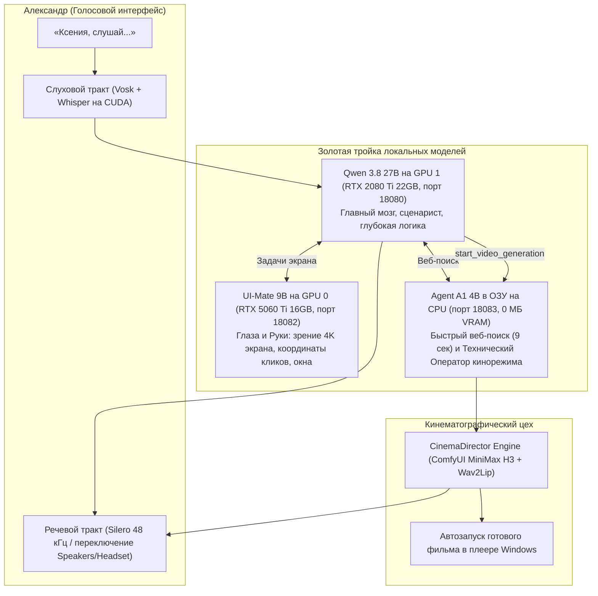

<p align="center">
  
</p>

<h1 align="center">Ассистент Ксения. Ваш полноценный партнёр!</h1>

<p align="center">
  Локальный русскоязычный голосовой дворецкий, исследователь и разработчик для Windows.
</p>

<p align="center">
  <a href="https://github.com/Alexperowo/assistant-ksenia/releases"></a>
  <a href="https://github.com/Alexperowo/assistant-ksenia/actions/workflows/tests.yml"></a>
  
  
  <a href="LICENSE"></a>
</p>

> [!CAUTION]
> **Это сырая альфа-версия.** Ксения уже проходит автоматические и живые проверки на эталонном компьютере, но установка на произвольное оборудование, физический голосовой контур и внешние сайты ещё требуют пользовательской приёмки. Не используйте alpha для критических, финансовых или необратимых действий.

Ксения создаётся как партнёр, а не как чат с моделью, «связанной по рукам». Она слышит русскую речь, озвучивает ответы, меняет локальные GGUF-модели по ролям, исследует интернет, работает с проектами и может управлять Windows. В обычном режиме рискованные действия подтверждаются; для заранее понятной работы Александр может локально включить одноразовую «Доверенную задачу» без повторных вопросов, но не без жёстких границ безопасности.

Проект изначально проектируется вместе со слабовидящим пользователем. Поэтому доступность здесь не дополнительная тема: голосовые статусы, управление без мыши, полные фразы, защита начала Bluetooth-аудио и понятная диагностика входят в архитектуру.

_English summary: an accessibility-first, local Russian voice assistant and developer-agent for Windows, powered by `llama.cpp`, role-based GGUF models, local memory, RAG and confirmable tools._

## Как появилась Ксения

Ксения родилась из идеи Александра — человека с инвалидностью первой группы по зрению, которому нужен не очередной чат, а полноценный, доступный и самостоятельный локальный партнёр. Личный опыт Александра определяет назначение проекта, требования к доступности и проверку в реальной жизни.

Идея и направление принадлежат человеку, а архитектура, код и документация создаются руками нейросети в постоянном диалоге с ним. Это совместная работа человеческого опыта и машинного исполнения: человек определяет, **зачем и какой должна быть Ксения**, а нейросеть помогает превращать замысел в работающую систему.

Связь с автором идеи: Telegram [@Alexperowo](https://t.me/Alexperowo).

## Что умеет Ксения

| Возможность | Реализация |
|---|---|
| Голосовая напарница | Полноценный диалог от женского лица («я готова», «я проверила»), ориентированный на восприятие на слух |
| Голосовая активация | Vosk Small RU: мгновенный отклик на «Ксения слушай» и «Ксения стоп» |
| Слух и диктовка | Faster-Whisper Large v3 Turbo на CUDA (int8_float16) с автоматическим откатом на микрофон Realtek при отключении Bluetooth |
| Голос и речь | Натуральный синтез Silero Xenia (48 кГц stereo), числа и даты словами |
| Аудиовывод на лету | Мгновенное голосовое переключение речи («звук на динамики», «звук на наушники») без разрыва микрофона |
| Золотая тройка моделей | Qwen 3.8 27B (мозг/сценарист), UI-Mate 9B (глаза/руки), Agent A1 4B (разведка/оператор) |
| Кинорежим (CinemaDirector) | Сценарий Ксении (5.167с / 124 кадра @ 24 fps, реплики до 8–10 слов крупным планом для Lip-Sync) → запуск оператора Agent A1 → рендер ComfyUI MiniMax H3 → голосовые доклады о шотах → автозапуск в плеере Windows |
| Зрение и экран | Нативный захват активного 4K-экрана (3840×2160, Per-Monitor DPI) и нормализованное визуальное наведение UI-Mate 9B за 2.4 секунды |
| Разведка и веб-поиск | Быстрый поиск Agent A1 4B в фоне (9–15 секунд) с верификацией источников и голосовым докладом Ксении |
| Управление Windows | Управление окнами (свернуть/развернуть/закрыть), ввод текста, клики мыши, каталог Winget |
| Память и контекст | Локальная база фактов SQLite, долговременная память, RAG-поиск и автосжатие контекста |
| Безопасность | Все рискованные действия, удаление файлов и внешние команды требуют подтверждения; финансовые операции заблокированы |

## Как устроен проект



## Принципы

- **Концепт напарницы:** Ксения — не безликий чат-бот, а верная напарница Александра с руками и глазами на компьютере, говорящая от женского лица.
- **Доступность по умолчанию:** Система проектируется для незрячего / слабовидящего пользователя (1-я группа). Все статусы, ошибки и результаты понятны на слух; визуальный контроль логов не требуется.
- **Рациональная триада моделей:** Отказ от раздутого «зоопарка» моделей. Три выверенные модели загружены одновременно без взаимного вытеснения: Qwen 27B на GPU 1, UI-Mate 9B на GPU 0, Agent A1 в системной памяти на CPU.
- **Калиброванные особенности рассуждения (Reasoning):**
  - *Qwen-27B:* штатный глубокий reasoning для сценариев и сложной логики с отсечением внутренних мыслей от речи.
  - *Agent A1:* строгий бюджет 256 токенов со стоп-фразой для моментального безошибочного вызова инструментов.
  - *UI-Mate:* быстрый визуальный grounding без философствования для максимальной точности координат на экране.
- **Нулевое доверие синтетике:** Никакой слепой веры статистическим тестам. Работоспособность каждого узла (звук, микрофон, экран, рендер) доказывается натурной проверкой на реальном оборудовании Windows.

## Текущее состояние и аппаратная привязка

На рабочей станции Александра (Windows 11, Dual GPU: RTX 5060 Ti 16 ГБ + RTX 2080 Ti 22 ГБ, 32 ГБ ОЗУ, 4K монитор) натурно проверены:

1. **Голосовой контур:** Vosk Small RU + Faster-Whisper на CUDA с автоматическим откатом на Realtek при отключенных Bluetooth-наушниках JBL.
2. **Речевой вывод:** Чистый стереозвук Silero v5 (`xenia`, 48 000 Гц), переключение вывода на динамики/наушники на лету.
3. **Зрение экрана:** Захват активного рабочего стола через `OpenInputDesktop` без ошибок Access Denied; UI-Mate 9B находит элементы на 4K за 2.4 секунды.
4. **Веб-поиск:** Фоновая разведка Agent A1 за 9.4 секунды с верификацией источников и озвучкой Ксенией.
5. **Кинорежим:** Сквозной пайплайн генерации (сценарий Ксении → передача `start_video_generation` → валидация Agent A1 за 3.2 секунды в RAM → диффузия MiniMax H3 → липсинк Wav2Lip → сведение 48 кГц со звуковыми докладами и автозапуском в плеере).
6. **Все три модели дежурят в памяти одновременно**, отклик на диалог составляет 1.7–2.0 секунды. Экспериментальные профили прошлых тестов (Laguna, Ornith) исключены из активного контура как избыточные.

Первый уровень — единая резидентная пара UI-Mate + Agents-A1. В быстром режиме UI-Mate отвечает напрямую, пока обе модели остаются загруженными. В Thinking-режиме Agents-A1 сначала формирует независимый анализ, затем UI-Mate проверяет его и выдаёт окончательный ответ. Переключение доступно голосом: «включи режим рассуждения» и «включи быстрый режим», а также пунктом 15 локального меню.

Это не универсальная рекомендация: веса, KV-кэш, speculative decoding, CUDA-буферы, ОЗУ и реальная скорость проверяются вместе. `HARDWARE-REPORT.cmd` предлагает только консервативную отправную точку и никогда не выбирает или не скачивает LLM автоматически.

Минимальная практическая среда alpha:

- Windows 11 x64;
- Python 3.12.10, который установщик размещает отдельно;
- современная NVIDIA для проверенного CUDA-контура или терпимый CPU-режим;
- достаточно места для выбранных GGUF, Whisper, Chromium и `llama.cpp`;
- интернет для online bootstrap и веб-исследований.

## Быстрый старт

1. Откройте [Releases](https://github.com/Alexperowo/assistant-ksenia/releases) и скачайте `Ksenia-0.1.0-online.zip`.
2. Распакуйте архив в постоянную папку. Не запускайте файлы прямо из ZIP.
3. Запустите `HARDWARE-REPORT.cmd`.
4. Запустите `INSTALL.cmd`. Это online bootstrap; он скачивает только закреплённые компоненты с проверками.
5. Скачайте выбранные GGUF отдельно и укажите их пути в `config/user.json`.
6. Запустите `AUDIT.cmd`, затем следуйте [универсальной инструкции](docs/USER-GUIDE.md).

Можно заранее выбрать разные диски:

```powershell
INSTALL.cmd -InstallRoot "<каталог среды>" -ModelStorageRoot "<каталог моделей>"
```

Полностью офлайн-набор пока не публикуется. Подробности и ограничения: [INSTALLATION.md](docs/INSTALLATION.md).

## Безопасность и приватность

- API моделей привязан к loopback и защищён локальным ключом.
- `config/user.json`, `runtime`, браузерный профиль, `workspace`, журналы и веса исключены из Git и релизов.
- Секретные расширения не читаются, не ищутся и не индексируются.
- После чтения локальных данных новый веб-запрос требует подтверждения в обычном режиме; одноразовая доверенная задача является явным предварительным согласием только для своего запроса.
- Неизвестный процесс на порту никогда не завершается от имени Ксении.
- Диагностика хранит метаданные, но не полный разговор, PIN, вводимый текст или содержимое файлов.

Уязвимости отправляйте приватно по [политике безопасности](SECURITY.md), не через публичный Issue.

## Документация

| Документ | Для чего нужен |
|---|---|
| [AGENTS.md](AGENTS.md) | Точка входа для нового разработчика или другой нейросети |
| [HANDOFF.md](docs/HANDOFF.md) | Передача состояния проекта без истории переписки |
| [ARCHITECTURE.md](docs/ARCHITECTURE.md) | Компоненты, процессы и потоки данных |
| [SOURCE-MAP.md](docs/SOURCE-MAP.md) | Карта исходного кода |
| [CONFIGURATION.md](docs/CONFIGURATION.md) | Слои и поля настроек |
| [DATA-AND-MIGRATIONS.md](docs/DATA-AND-MIGRATIONS.md) | Память, базы и миграции |
| [SECURITY.md](docs/SECURITY.md) | Модель угроз и технические ограничения |
| [TESTING.md](docs/TESTING.md) | Стратегия автоматических и живых проверок |
| [PERFORMANCE.md](docs/PERFORMANCE.md) | Сквозные trace_id, milestones, p50/p95 и измерение Live-задержек |
| [RUNTIME-OPTIMIZATION-BASELINE.md](docs/RUNTIME-OPTIMIZATION-BASELINE.md) | Реальные 16K/32K/48K/96K, KV reuse и решение по стабильным ToolProfiles |
| [FAST-RESIDENT-MODELS-BASELINE-2026-08-31.md](docs/FAST-RESIDENT-MODELS-BASELINE-2026-08-31.md) | UI-Mate + Agents-A1, совместная резидентность и измеренные FAST/DELIBERATE режимы |
| [FAST-RESEARCH-ROUTING-2026-08-31.md](docs/FAST-RESEARCH-ROUTING-2026-08-31.md) | безопасное переключение резидентной пары и реальный Agents-A1 web-research baseline |
| [SCREEN-CAPTURE-BASELINE-2026-08-31.md](docs/SCREEN-CAPTURE-BASELINE-2026-08-31.md) | физический Per-Monitor DPI capture и fail-closed mapping координат UI-Mate |
| [UI-MATE-READONLY-ACCEPTANCE-2026-08-31.md](docs/UI-MATE-READONLY-ACCEPTANCE-2026-08-31.md) | воспроизводимый read-only corpus, строгие альтернативы действий и первый результат 3/3 |
| [AUDIO-FULL-DUPLEX-AUDIT.md](docs/AUDIO-FULL-DUPLEX-AUDIT.md) | Фактический аудиотракт, AEC-кандидаты и этапы безопасного full-duplex |
| [SANDBOX-AUDIT.md](docs/SANDBOX-AUDIT.md) | Фактические Windows-границы, проверенные blockers и критерии Sandbox Worker |
| [MAINTENANCE.md](docs/MAINTENANCE.md) | Обновление и откат |
| [DECISIONS.md](docs/DECISIONS.md) | Причины ключевых архитектурных решений |

## Участие в разработке

Проект приветствует воспроизводимые ошибки, предложения по доступности и небольшие проверяемые pull requests. Перед началом прочитайте [CONTRIBUTING.md](CONTRIBUTING.md).

Лёгкий gate не требует GPU или моделей:

```powershell
python scripts\run_test_suite.py --order-audit
python scripts\validate_release.py
```

## Лицензия и благодарности

Код распространяется по лицензии [MIT](LICENSE).

Автор идеи, требований и пользовательской проверки — Александр, [@Alexperowo](https://t.me/Alexperowo). Проект создаётся в сотрудничестве человека и нейросети.

Эмблема и набор Windows-иконок созданы специально для Ксении и хранятся в `assets/icons`. Проект использует и объединяет возможности `llama.cpp`, Silero, Vosk, faster-whisper, Playwright и других открытых компонентов; их собственные лицензии применяются отдельно.

Ксения не аффилирована с авторами используемых community-моделей. Названия моделей в документации описывают проверенные профили alpha, а не включённые в репозиторий веса.
