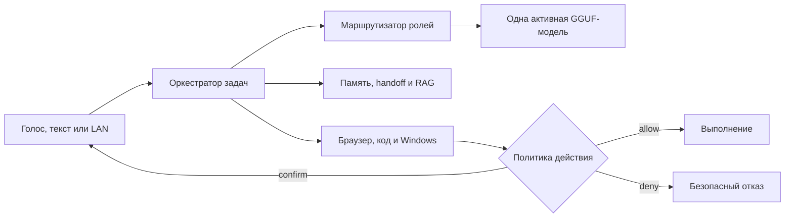

<p align="center">
  
</p>

<h1 align="center">Ассистент Ксения. Ваш полноценный партнёр!</h1>

<p align="center">
  Локальный русскоязычный голосовой дворецкий, исследователь и разработчик для Windows.
</p>

<p align="center">
  <a href="https://github.com/Alexperowo/assistant-ksenia/releases"></a>
  <a href="https://github.com/Alexperowo/assistant-ksenia/actions/workflows/tests.yml"></a>
  
  
  <a href="LICENSE"></a>
</p>

> [!CAUTION]
> **Это сырая альфа-версия.** Ксения уже проходит автоматические и живые проверки на эталонном компьютере, но установка на произвольное оборудование, физический голосовой контур и внешние сайты ещё требуют пользовательской приёмки. Не используйте alpha для критических, финансовых или необратимых действий.

Ксения создаётся как партнёр, а не как чат с моделью, «связанной по рукам». Она слышит русскую речь, озвучивает ответы, меняет локальные GGUF-модели по ролям, исследует интернет, работает с проектами и может управлять Windows — но каждое рискованное действие проходит понятную политику разрешений и подтверждение пользователя.

Проект изначально проектируется вместе со слабовидящим пользователем. Поэтому доступность здесь не дополнительная тема: голосовые статусы, управление без мыши, полные фразы, защита начала Bluetooth-аудио и понятная диагностика входят в архитектуру.

_English summary: an accessibility-first, local Russian voice assistant and developer-agent for Windows, powered by `llama.cpp`, role-based GGUF models, local memory, RAG and confirmable tools._

## Как появилась Ксения

Ксения родилась из идеи Александра — человека с инвалидностью первой группы по зрению, которому нужен не очередной чат, а полноценный, доступный и самостоятельный локальный партнёр. Личный опыт Александра определяет назначение проекта, требования к доступности и проверку в реальной жизни.

Идея и направление принадлежат человеку, а архитектура, код и документация создаются руками нейросети в постоянном диалоге с ним. Это совместная работа человеческого опыта и машинного исполнения: человек определяет, **зачем и какой должна быть Ксения**, а нейросеть помогает превращать замысел в работающую систему.

Связь с автором идеи: Telegram [@Alexperowo](https://t.me/Alexperowo).

## Что умеет Ксения

| Возможность | Реализация |
|---|---|
| Голосовая активация | Vosk: «Ксения слушай» и «Ксения стоп» |
| Диктовка | faster-whisper Large v3 Turbo, CUDA или CPU fallback |
| Русский голос | Silero Xenia, числа и даты словами, Windows SAPI как резерв |
| Локальные модели | Одна активная GGUF-модель через `llama.cpp`, переключение по ролям |
| Роли | Ассистент, исследователь, разработчик и тяжёлый мозг |
| Длинные задачи | Контекст до 64K, асимметричный KV, MTP, сжатие истории |
| Память | Последние реплики, подтверждённые факты, межролевая передача и гибридный RAG |
| Исследование | Поиск, параллельное чтение страниц, источники, товары и реальные цены |
| Разработка | Файлы только в `workspace`, тесты, резервные копии и безопасная отмена |
| Windows | UI Automation, клавиатура и подтверждаемый резерв мыши |
| Телефон | Доступная LAN-панель с PIN, паузой, отменой и подтверждением |

Покупки, платежи и переводы денег заблокированы. Фактическая отправка сообщения, удаление, запись и внешние действия требуют отдельного подтверждения.

## Как устроен проект



Модель не является источником полномочий. Оркестратор отдельно контролирует инструменты, границы рабочей папки, процессы, тайм-ауты, подтверждения и журнал изменений.

## Принципы

- **Локальность:** LLM, память, распознавание и синтез речи работают на компьютере пользователя. Интернет используется только для явно запрошенного исследования и загрузки компонентов.
- **Простое управление:** обычная работа начинается ярлыком, голосовой фразой, горячей клавишей или телефоном.
- **Одна модель за раз:** VRAM освобождается при смене роли, а задача и память переходят следующей модели.
- **Качество важнее рекорда скорости:** длинный контекст дополняется RAG и сжатием, а не бессистемной загрузкой всех файлов.
- **Нулевая вера внешнему вводу:** ответы LLM, веб-страницы, tool arguments и неизвестные процессы считаются недоверенными.
- **Доступность по умолчанию:** результат должен быть понятен на слух и управляться без точного визуального наведения.

## Текущее состояние alpha

На эталонной системе Windows 11 LTSC, RTX 5060 Ti 16 ГБ и 16 ГБ ОЗУ проверены:

- 191 unit/integration-тест и три дополнительных прогона в случайном порядке;
- локальная LLM с фактическим контекстом 65536;
- MTP, асимметричный KV `K=q8_0`, `V=q5_0`;
- русский TTS → WAV → faster-whisper на CUDA без потери контрольных частей;
- RAG, LAN, браузерное исследование, процессы и безопасные инструменты;
- стадийная установка, резервная копия и откат `llama.cpp`;
- распаковка release ZIP и изолированный online installer smoke-test.

Остаётся ручная приёмка физического микрофона и динамиков, Bluetooth-кнопок, телефона в домашней сети и действий на настоящих сайтах. Точный статус находится в [ROADMAP](docs/ROADMAP.md) и [аудите](docs/AUDIT.md).

## Модели и оборудование

Модели не входят в Git и релизный ZIP. Архитектура не привязана к одному GGUF: роли могут использовать разные Dense/MoE community-модели, а при переключении предыдущая модель выгружается.

Эталонная конфигурация использует 9–12B исполнителей и 26B-A4B планировщик. Это не универсальная рекомендация: размер weights, KV-кэш, MTP, CUDA buffers, ОЗУ и реальная скорость проверяются вместе. `HARDWARE-REPORT.cmd` предлагает только консервативную отправную точку и никогда не скачивает модель автоматически.

Минимальная практическая среда alpha:

- Windows 11 x64;
- Python 3.12.10, который установщик размещает отдельно;
- современная NVIDIA для проверенного CUDA-контура или терпимый CPU-режим;
- достаточно места для выбранных GGUF, Whisper, Chromium и `llama.cpp`;
- интернет для online bootstrap и веб-исследований.

## Быстрый старт

1. Откройте [Releases](https://github.com/Alexperowo/assistant-ksenia/releases) и скачайте `Ksenia-0.1.0-online.zip`.
2. Распакуйте архив в постоянную папку. Не запускайте файлы прямо из ZIP.
3. Запустите `HARDWARE-REPORT.cmd`.
4. Запустите `INSTALL.cmd`. Это online bootstrap; он скачивает только закреплённые компоненты с проверками.
5. Скачайте выбранные GGUF отдельно и укажите их пути в `config/user.json`.
6. Запустите `AUDIT.cmd`, затем следуйте [универсальной инструкции](docs/USER-GUIDE.md).

Можно заранее выбрать разные диски:

```powershell
INSTALL.cmd -InstallRoot "E:\KseniaRuntime" -ModelStorageRoot "F:\AI\Models"
```

Полностью офлайн-набор пока не публикуется. Подробности и ограничения: [INSTALLATION.md](docs/INSTALLATION.md).

## Безопасность и приватность

- API моделей привязан к loopback и защищён локальным ключом.
- `config/user.json`, `runtime`, браузерный профиль, `workspace`, журналы и веса исключены из Git и релизов.
- Секретные расширения не читаются, не ищутся и не индексируются.
- После чтения локальных данных новый веб-запрос требует подтверждения.
- Неизвестный процесс на порту никогда не завершается от имени Ксении.
- Диагностика хранит метаданные, но не полный разговор, PIN, вводимый текст или содержимое файлов.

Уязвимости отправляйте приватно по [политике безопасности](SECURITY.md), не через публичный Issue.

## Документация

| Документ | Для чего нужен |
|---|---|
| [AGENTS.md](AGENTS.md) | Точка входа для нового разработчика или другой нейросети |
| [HANDOFF.md](docs/HANDOFF.md) | Передача состояния проекта без истории переписки |
| [ARCHITECTURE.md](docs/ARCHITECTURE.md) | Компоненты, процессы и потоки данных |
| [SOURCE-MAP.md](docs/SOURCE-MAP.md) | Карта исходного кода |
| [CONFIGURATION.md](docs/CONFIGURATION.md) | Слои и поля настроек |
| [DATA-AND-MIGRATIONS.md](docs/DATA-AND-MIGRATIONS.md) | Память, базы и миграции |
| [SECURITY.md](docs/SECURITY.md) | Модель угроз и технические ограничения |
| [TESTING.md](docs/TESTING.md) | Стратегия автоматических и живых проверок |
| [MAINTENANCE.md](docs/MAINTENANCE.md) | Обновление и откат |
| [DECISIONS.md](docs/DECISIONS.md) | Причины ключевых архитектурных решений |

## Участие в разработке

Проект приветствует воспроизводимые ошибки, предложения по доступности и небольшие проверяемые pull requests. Перед началом прочитайте [CONTRIBUTING.md](CONTRIBUTING.md).

Лёгкий gate не требует GPU или моделей:

```powershell
python scripts\run_test_suite.py --order-audit
python scripts\validate_release.py
```

## Лицензия и благодарности

Код распространяется по лицензии [MIT](LICENSE).

Автор идеи, требований и пользовательской проверки — Александр, [@Alexperowo](https://t.me/Alexperowo). Проект создаётся в сотрудничестве человека и нейросети.

Эмблема и набор Windows-иконок созданы специально для Ксении и хранятся в `assets/icons`. Проект использует и объединяет возможности `llama.cpp`, Silero, Vosk, faster-whisper, Playwright и других открытых компонентов; их собственные лицензии применяются отдельно.

Ксения не аффилирована с авторами используемых community-моделей. Названия моделей в документации описывают проверенные профили alpha, а не включённые в репозиторий веса.
